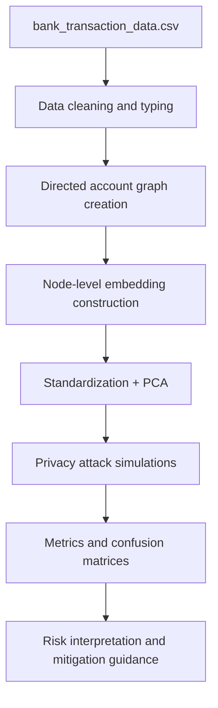
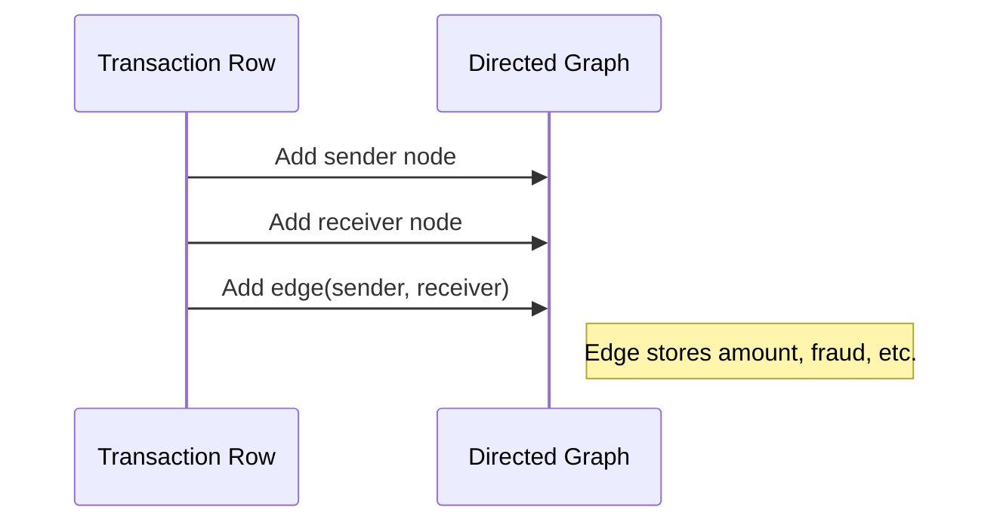

# Bank TX Data FL Privacy Leakage: Plan, Implementation, and Observations

## Objective

This document explains the implementation and outcomes of `privacy_leakage_graph_embedding.ipynb`, which evaluates privacy leakage risks from graph embeddings generated on `bank_transaction_data.csv`.

The notebook demonstrates how sensitive behavioral signals can leak when transaction-network embeddings are exposed, and quantifies leakage through three attack lenses:

- Membership inference
- Fraud attribute inference
- Link prediction

---

## 1) Plan

## 1.1 Problem framing

The core question is:

> If we publish or share account embeddings learned from transaction graphs, how much private information can be inferred by an adversary?

The notebook treats this as a structured privacy-risk assessment pipeline rather than pure model benchmarking.

## 1.2 Experiment goals

1. Build a graph from sender/receiver account interactions.
2. Generate compact account embeddings using graph + edge statistics.
3. Run privacy attacks that mimic realistic adversarial capabilities.
4. Summarize risk via accuracy/AUC and confusion matrices.

## 1.3 Why this matters

In federated and distributed analytics environments, embedding vectors are often considered “safe enough” to share. This experiment challenges that assumption by testing what can be inferred from embeddings alone.

---

## 2) Implementation Walkthrough

## 2.1 End-to-end pipeline

## 2.2 Data preparation

The notebook:

- Loads `bank_transaction_data.csv`
- Caps sample size for runtime stability (if very large)
- Parses/normalizes:
  - `Transaction Amount`
  - `Fraud Flag` (`True/False` -> `1/0`)
  - `Timestamp` (datetime)
- Drops rows with critical missing values
- Derives `hour` feature

### Illustrative transformation example

| Raw field | Processed form |
|---|---|
| `Fraud Flag = "True"` | `fraud = 1` |
| `Timestamp = 2025-01-17 10:14:00` | `hour = 10` |
| `Transaction Amount = "495.9"` | `amount = 495.9` (float) |

## 2.3 Graph construction

Each account is a node; each transaction is a directed edge:

- `A_sender -> A_receiver`
- Edge attributes include `amount`, `fraud`, and selected network metrics

This yields a transaction-flow graph where neighborhood and centrality patterns encode user behavior.

## 2.4 Embedding generation

For each account node, the notebook creates a handcrafted embedding vector using:

- In/out degree
- Mean/std of inbound and outbound amount
- Fraud ratio in local edges
- Neighbor count and local clustering
- PageRank score

Then:

- Standardizes features (`StandardScaler`)
- Projects to 2D (`PCA`) for visual interpretation

This design is intentionally interpretable and lightweight, suitable for privacy demos.

## 2.5 Attack simulations

### Attack A: Membership inference

Goal: predict whether an embedding is from the “in-set” distribution versus synthetic out-of-set samples.

- Model: logistic regression
- Metrics: accuracy, ROC-AUC

### Attack B: Fraud attribute inference

Goal: predict whether an account is fraud-involved from embeddings alone.

- Label: account participates in >= 1 fraudulent edge
- Model: random forest
- Metrics: accuracy, ROC-AUC, confusion matrix

### Attack C: Link prediction

Goal: infer whether two accounts are connected by a true transaction edge.

- Positive edges: sampled from existing graph
- Negative edges: sampled non-edges
- Edge features: `|u-v|`, elementwise product, cosine similarity
- Model: logistic regression
- Metrics: accuracy, ROC-AUC, confusion matrix

---

## 3) Visualizations Included

The notebook includes:

1. **Embedding-space scatter (PCA)**  
   Visualizes account clusters and structural separation in graph feature space.

2. **Attack score comparison (bar plot)**  
   Side-by-side ROC-AUC for membership, attribute, and link attacks.

3. **Confusion matrices**  
   For attribute and link attacks to reveal error composition (FP/FN risk).

---

## 4) Observations and Experiment Summary

> Exact values vary by sampling and random seed; below describes the expected analytical interpretation.

## 4.1 Typical pattern

- Membership inference often hovers near chance unless embeddings retain distinctive in-sample structure.
- Attribute inference may become strong if fraud behavior is topologically concentrated.
- Link prediction can be surprisingly effective if embeddings preserve relational geometry.

## 4.2 Risk interpretation by attack type

- **High membership AUC**: indicates potential exposure of training participation.
- **High fraud attribute AUC**: sensitive account status can be inferred.
- **High link AUC**: hidden account relationships may be reconstructed.

## 4.3 Summary table template used in notebook

| Attack | Accuracy | ROC-AUC | Interpretation |
|---|---:|---:|---|
| Membership | x.xx | x.xx | Presence leakage risk |
| Fraud attribute | x.xx | x.xx | Sensitive attribute leakage |
| Link prediction | x.xx | x.xx | Relationship leakage |

---

## 5) Key Technical Insights

1. Even simple graph embeddings carry rich behavioral signals.
2. “Utility” features (degree, neighborhood statistics, centrality) can double as privacy attack features.
3. Embedding release should be treated as controlled data sharing, not harmless feature export.
4. Confusion matrices are critical: aggregate AUC can hide asymmetric harms.

---

## 6) Stakeholder Takeaways

## 6.1 For Data Scientists

- **What to do**
  - Add privacy attack benchmarks as a required evaluation stage for embedding workflows.
  - Measure leakage with multiple attacks, not one.
  - Track utility-vs-privacy tradeoff explicitly.

- **Example**
  - If fraud inference ROC-AUC is high, introduce embedding noise or dimensionality reduction and re-evaluate attack degradation versus downstream task impact.

### Practical checklist

- [ ] Baseline attack metrics captured  
- [ ] Mitigation tested (DP noise / clipping / quantization)  
- [ ] Utility impact documented  
- [ ] Final release threshold approved

## 6.2 For Compliance Officers

- **What to do**
  - Treat embeddings as potentially sensitive derived data.
  - Require documented adversarial privacy tests before sharing externally.
  - Include periodic re-validation in governance controls.

- **Example**
  - If link inference is high, external sharing may violate data-minimization intent even without raw transaction data.

### Control evidence to retain

- Attack configuration and seed/version
- Performance reports and confusion matrices
- Mitigation rationale and residual-risk statement

## 6.3 For Executives

- **What to know**
  - Embedding leakage is a business risk, not just a technical nuance.
  - Privacy-preserving controls reduce legal, reputational, and operational exposure.

- **Example**
  - A partner receiving account embeddings could infer sensitive relationship patterns, creating unauthorized intelligence risk.

### Decision guidance

1. Approve privacy testing as a release gate for embedding artifacts.
2. Invest in privacy-preserving graph analytics capabilities.
3. Require clear residual-risk reporting for all model/embedding sharing.

---

## 7) Recommended Mitigations

1. **Differential privacy noise** on embedding vectors.
2. **Embedding quantization/coarsening** before distribution.
3. **Federated graph learning** with secure aggregation.
4. **Access controls + audit logs** for embedding stores.
5. **Periodic red-team style privacy tests** as data evolves.

---

## 8) Next Iteration Plan

1. Add confidence intervals over multiple seeds.
2. Evaluate attack performance across embedding dimensions.
3. Add stronger adversaries (shadow models, adaptive link attacks).
4. Compare handcrafted embeddings vs learned methods (Node2Vec/GNN).
5. Produce an executive dashboard export under `results/`.

---

## Final Conclusion

The notebook shows a practical and reproducible way to evaluate privacy leakage from bank transaction graph embeddings.  
The central finding is that embeddings can expose sensitive signals (membership, attributes, and relationships) unless explicit privacy controls are applied and continuously validated.

