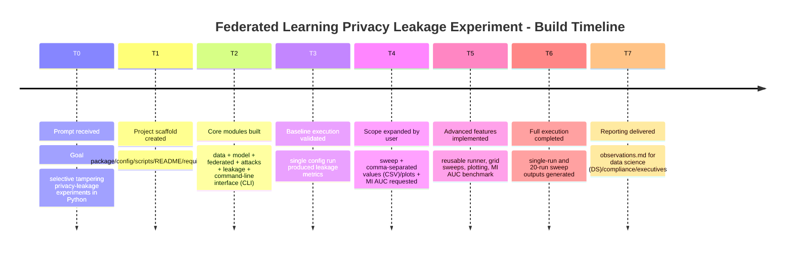
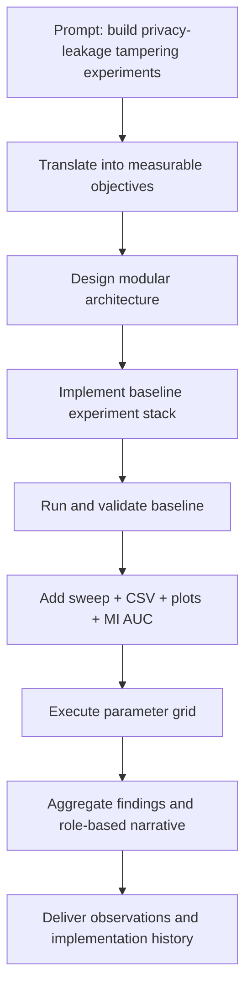

# Plan and Implementation

This document explains how the experiment was built from the initial request through implementation and execution, as a timeline of events.

## 1) Initial Prompt and Goal Definition

**User objective:** build Python experiments for privacy leakage attacks against federated language models using selective weight tampering.

**Operational goals derived from the prompt:**

- Build a runnable Federated Learning (FL) language-model simulation.
- Add selective weight tampering attack controls.
- Measure privacy leakage using canary-based signals.
- Extend to multi-run sweeps, CSV logging, plots, and a stronger benchmark (membership inference AUC).
- Produce role-based observations for technical and non-technical stakeholders.

## 2) Planning Phase (Design Decisions)

### 2.1 Why a toy Federated Language Model (FL-LM) first

- Chosen to validate hypotheses quickly and safely.
- Keeps iteration speed high while preserving key attack dynamics.
- Makes attack/defense parameter sweeps computationally practical.

### 2.2 Experiment architecture selected

- **Data layer:** synthetic per-client token streams + canary pair injection.
- **Model layer:** tiny next-token model in NumPy (embedding + output projection).
- **Federated loop:** client-local Stochastic Gradient Descent (SGD) and server-side Federated Averaging (FedAvg).
- **Attack layer:** selective tampering on chosen layers/token coordinates.
- **Evaluation layer:** canary exposure metrics and later Membership Inference Area Under the Curve (MI AUC).

### 2.3 Success criteria

- End-to-end run from config file to metrics.
- Reproducibility through explicit seeds and JSON configs.
- Sweep-ready workflow with machine-readable outputs (CSV) and human-readable outputs (plots/docs).

## 3) Implementation Timeline

## T0 - Project scaffold created

- Created folders: `fl_privacy_tampering`, `configs`, `scripts`.
- Added `README.md` and `requirements.txt`.

## T1 - Core experiment modules implemented

- `fl_privacy_tampering/data.py`
  - Synthetic client streams
  - Canary injection by client ID
- `fl_privacy_tampering/model.py`
  - Tiny Language Model (LM) with softmax and local SGD
- `fl_privacy_tampering/attacks.py`
  - Selective tampering logic (`target_layers`, `target_token_ids`, `scale`, `noise_std`)
- `fl_privacy_tampering/federated.py`
  - FedAvg loop + attacker hook
- `fl_privacy_tampering/leakage.py`
  - Canary loss, control loss, exposure gap, target rank
- `scripts/run_experiment.py`
  - Config-driven run + printed metrics
- `configs/baseline.json`
  - Baseline training, attack, and evaluation config

## T2 - First execution and baseline verification

- Ran:
  - `python3 -m scripts.run_experiment --config configs/baseline.json`
- Confirmed end-to-end outputs were produced and interpretable.

## T3 - Expansion requested (sweep + logging + stronger benchmark)

User requested:

- Multi-run sweep (attack/no-attack + parameter grid)
- CSV logging + plots
- Membership inference Area Under the Curve (AUC) benchmark

## T4 - Implementation of expanded capabilities

- Enhanced `scripts/run_experiment.py`
  - Extracted reusable `run_experiment(cfg)` function
  - Added `--csv` append logging mode
  - Added MI AUC reporting fields
- Extended `fl_privacy_tampering/leakage.py`
  - Added `MembershipInferenceResult`
  - Added Receiver Operating Characteristic Area Under the Curve (ROC-AUC) computation from sequence-loss scores
- Added `scripts/run_sweep.py`
  - Grid expansion from dotted config keys
  - Per-run execution with seed offsets
  - Consolidated `sweep_results.csv`
  - Auto-generated Portable Network Graphics (PNG) plots
- Added `configs/sweep_grid.json`
  - Attack toggles and parameter grid
- Updated documentation/dependencies
  - `README.md` usage updates
  - `requirements.txt` includes `matplotlib`

## T5 - Validation of expanded experiment

- Ran:
  - `python3 -m scripts.run_experiment --config configs/baseline.json --csv results/single_run.csv`
  - `python3 -m scripts.run_sweep --config configs/baseline.json --grid configs/sweep_grid.json --outdir results/sweep`
- Verified artifacts generated:
  - `results/single_run.csv`
  - `results/sweep/sweep_results.csv`
  - sweep plot PNGs

## T6 - Interpretation and communication artifacts

- Created `observations.md` with:
  - Data-science interpretation
  - Compliance interpretation
  - Executive interpretation
  - Mermaid diagrams and concrete examples from actual runs

## 4) Timeline (Mermaid)



## 5) Construction Flow (Mermaid)



## 6) Deliverables Produced

- Code:
  - `fl_privacy_tampering/data.py`
  - `fl_privacy_tampering/model.py`
  - `fl_privacy_tampering/attacks.py`
  - `fl_privacy_tampering/federated.py`
  - `fl_privacy_tampering/leakage.py`
  - `scripts/run_experiment.py`
  - `scripts/run_sweep.py`
- Configs:
  - `configs/baseline.json`
  - `configs/sweep_grid.json`
- Results:
  - `results/single_run.csv`
  - `results/sweep/sweep_results.csv`
  - `results/sweep/*.png`
- Documentation:
  - `README.md`
  - `observations.md`
  - `Plan-and-implementation.md` (this file)

## 7) Repro Steps (Current State)

```bash
python3 -m scripts.run_experiment --config configs/baseline.json --csv results/single_run.csv
python3 -m scripts.run_sweep --config configs/baseline.json --grid configs/sweep_grid.json --outdir results/sweep
```
