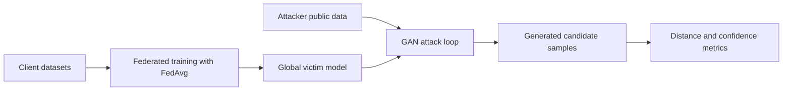
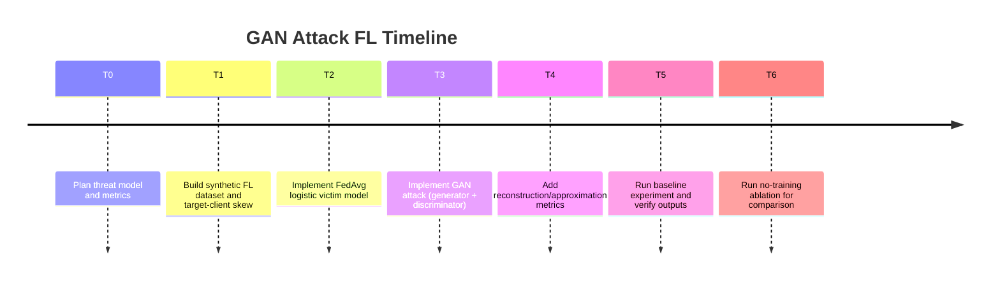
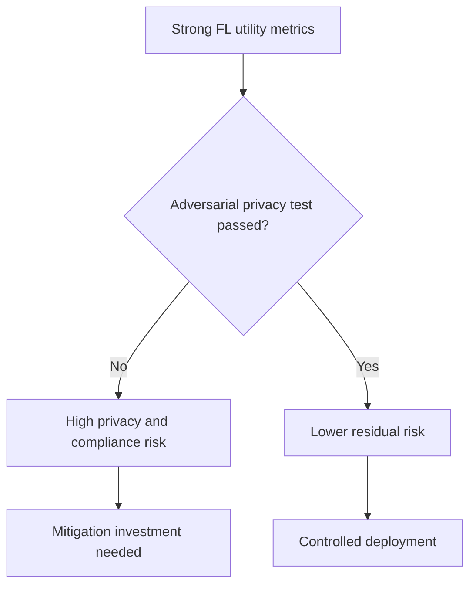

# GAN-Attack-FederatedLearning: Plan, Implementation, and Observations

This document summarizes the design, implementation, execution, and interpretation of a toy **GAN-based attack against Federated Learning (FL)**.

## 1) Plan

### 1.1 Objective

Test whether an attacker can use a Generative Adversarial Network (GAN) style process to generate samples that approximate a target client's private class distribution in FL.

### 1.2 Threat Model

- FL server trains a global classifier with `FedAvg`.
- Target client has a skew toward one private class.
- Attacker has:
  - global model parameters (post-training),
  - limited auxiliary/public data for the target class,
  - no direct access to target client raw data.

### 1.3 Success Criteria

- High model utility (global test accuracy remains high).
- Generated samples have:
  - lower distance to target private samples than a no-training baseline,
  - high victim-model confidence for target class.

## 2) Implementation

### 2.1 Files added

- `gan_attack_fl/data.py`
  - synthetic multi-client data with one target client skewed to a private class.
- `gan_attack_fl/federated.py`
  - federated logistic classifier with local training + federated averaging.
- `gan_attack_fl/attack.py`
  - GAN-style attack loop:
    - discriminator learns real-vs-fake on attacker public target-class samples,
    - generator both fools discriminator and maximizes victim target-class confidence.
- `gan_attack_fl/metrics.py`
  - attack metrics (mean distance, covariance distance, nearest-neighbor distance, target confidence).
- `scripts/run_gan_attack_fl.py`
  - end-to-end experiment runner.
- `configs/gan_attack_fl_baseline.json`
  - baseline hyperparameters.

### 2.2 Execution flow



## 3) Execution Timeline



## 4) Experiment Configuration

From `configs/gan_attack_fl_baseline.json`:

- Clients: `6`
- Points/client: `400`
- Target client: `2`
- Target private class: `1`
- FL training: `25` rounds, `10` local steps, `lr=0.15`
- GAN attack: `350` steps, `noise_dim=4`, `batch_size=64`

## 5) Results

### 5.1 Baseline run

Command:

```bash
python3 -m scripts.run_gan_attack_fl --config configs/gan_attack_fl_baseline.json
```

Observed:

- `global_test_accuracy: 0.995000`
- `mean_distance_to_target_private: 1.570988`
- `covariance_distance_to_target_private: 1.305462`
- `nearest_neighbor_distance: 0.171693`
- `target_confidence_on_generated: 0.920800`

Interpretation:

- FL model remains highly accurate.
- Attack produces target-class-looking samples with high victim confidence.
- Nearest-neighbor similarity indicates generated points move close to private target distribution in this toy setting.

### 5.2 Example ablation (no GAN training vs GAN attack)

Measured by running attack with `attack_steps=0` vs `attack_steps=350`:

- No GAN training:
  - `mean_dist: 2.543085`
  - `nn_dist: 0.383232`
  - `target_conf: 0.508355`
- GAN attack:
  - `mean_dist: 1.570988`
  - `nn_dist: 0.171693`
  - `target_conf: 0.920800`

This suggests the GAN optimization materially improves approximation of target-private distribution under the chosen assumptions.

## 6) Explanations by Audience

### 6.1 For Data Scientists

- This experiment is a **post-training generative attack** against FL.
- The generator objective combines:
  - adversarial realism (fool discriminator),
  - victim-guided class targeting (maximize target-class confidence from global model).
- Empirical evidence from ablation:
  - `mean_dist` drops from `2.543` to `1.571`,
  - `nn_dist` drops from `0.383` to `0.172`,
  - target confidence rises from `0.508` to `0.921`.
- Example reading:
  - high model utility (`0.995`) does not imply low leakage risk.

### 6.2 For Compliance Officers

- Key risk: private client characteristics may be inferred/approximated without direct data access.
- Why this matters:
  - potential personal data inference risk in multi-party FL deployments.
- Evidence:
  - attack improves similarity to target-private class and increases confidence dramatically.
- Controls to consider:
  - reduce exposure of model outputs/weights,
  - robust aggregation and client-level anomaly monitoring,
  - privacy testing gates (including generative attack scenarios) before release.

### 6.3 For Executives

- Plain-language takeaway:
  - an attacker can use the trained FL model to synthesize data that resembles a target participant's private patterns.
- Business implication:
  - privacy and trust risks can persist even when raw data never leaves clients.
- Decision implication:
  - treat adversarial privacy testing as a release requirement, not optional validation.



## 7) Limitations

- Toy synthetic 2D data and simple logistic victim model.
- Attack uses attacker public data and post-training model access assumptions.
- Distances are proxy leakage indicators, not legal/privacy determinations by themselves.

## 8) Recommended Next Steps

- Multi-seed statistics and confidence intervals.
- Harder settings: distribution shift, fewer public samples, stronger regularization.
- Compare defenses:
  - Differential Privacy,
  - output clipping/temperature limits,
  - secure aggregation variants and access controls.
