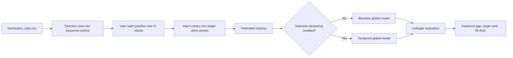
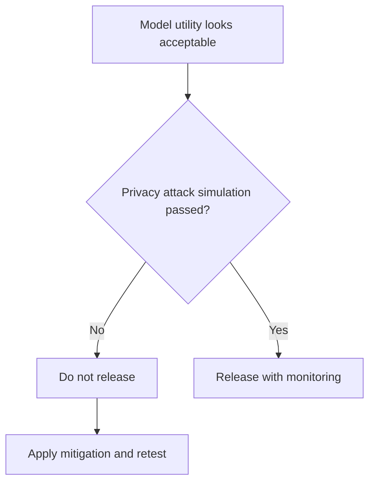
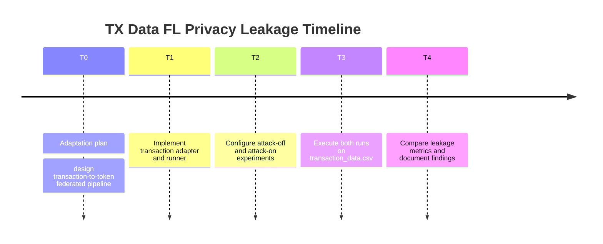

# TX Data FL Privacy Leakage: Plan, Implementation, and Observations

This document describes how `FL-Privacy-Leakage` was adapted to `transaction_data.csv`, executed, and interpreted.

## 1) Plan

### Objective

Evaluate privacy leakage behavior in a federated language-model style setup when client token streams are derived from real transaction records.

### Strategy

- Convert transaction rows into compact token sequences.
- Partition users into federated clients.
- Inject a canary pair into a target client stream.
- Compare **attack off** vs **attack on** selective weight tampering.
- Measure:
  - canary leakage (`exposure_gap`, `target_rank`)
  - membership inference AUC (MI AUC)

## 2) Implementation

### Files Added

- `FL-Privacy-Leakage/fl_privacy_tampering/transaction_data.py`
  - Parses `transaction_data.csv`
  - Converts rows into token triples:
    - tokenized quantity
    - tokenized transaction value
    - hour token
  - Hash-partitions users into clients
  - Injects canary pair into selected client
- `FL-Privacy-Leakage/scripts/run_experiment_transaction.py`
  - Transaction-specific FL leakage runner
- Configs:
  - `FL-Privacy-Leakage/configs/tx_baseline_attack_off.json`
  - `FL-Privacy-Leakage/configs/tx_baseline_attack_on.json`

### Execution Flow



## 3) Execution

Commands run from `FL-Privacy-Leakage/`:

```bash
python3 -m scripts.run_experiment_transaction --config configs/tx_baseline_attack_off.json --csv results/tx_fl_privacy_runs.csv
python3 -m scripts.run_experiment_transaction --config configs/tx_baseline_attack_on.json --csv results/tx_fl_privacy_runs.csv
```

Result file:

- `FL-Privacy-Leakage/results/tx_fl_privacy_runs.csv`

## 4) Observations

### Attack Off

- `canary_loss = 4.84797`
- `control_loss = 4.86519`
- `exposure_gap = 0.01722`
- `target_rank = 49`
- `mi_auc = 0.5`

### Attack On

- `canary_loss = 4.76751`
- `control_loss = 4.86366`
- `exposure_gap = 0.09615`
- `target_rank = 24`
- `mi_auc = 0.5`

### Delta (On vs Off)

- `exposure_gap`: `0.01722 -> 0.09615` (**+0.07893**)
- `target_rank`: `49 -> 24` (lower rank = leakier)
- `mi_auc`: unchanged at `0.5`

Interpretation:

- Selective tampering increased canary leakage indicators on this transaction-derived setup.
- Membership inference metric remained uninformative in this 2-run setting (AUC 0.5).

## 5) Role-Specific Explanation

### For Data Scientists

- The adaptation maps transaction behavior into token dynamics while preserving federated partitioning by user identity.
- Leakage signal strengthened under tampering:
  - higher exposure gap,
  - lower target rank.
- Example:
  - canary rank improved from `49` to `24` after attack, indicating stronger model preference for canary continuation.
- MI AUC remained flat (`0.5`), suggesting this particular setup is more sensitive to canary-based leakage than sequence-loss membership discrimination.

### For Compliance Officers

- This experiment shows a practical privacy-risk direction: model update tampering can amplify memorization-like leakage behavior.
- Even without raw data centralization, manipulated FL updates can alter privacy posture.
- Recommended controls:
  - robust aggregation and update anomaly checks,
  - release gating on leakage deltas (e.g., exposure-gap jump thresholds),
  - mandatory adversarial privacy testing before deployment.
- Example policy trigger:
  - block release if attack simulation increases exposure gap beyond predefined tolerance.

### For Executives

- Plain-language finding:
  - when we simulate malicious update tampering, the model becomes more likely to memorize and expose targeted patterns.
- Business implication:
  - federated architecture reduces some risks, but not all; adversarial behavior can still increase privacy exposure.
- Decision implication:
  - include privacy attack simulations in launch criteria alongside accuracy/quality metrics.



## 6) Timeline



## 7) Limitations and Next Steps

- Results are from a compact 2-run comparison; expand to multi-seed sweeps.
- Tokenization is intentionally simple; richer token design may expose additional dynamics.
- Recommended next steps:
  - run sweep over attack scales/noise and multiple seeds,
  - add confidence intervals,
  - evaluate defenses (clipping, robust aggregation, differential privacy noise).
