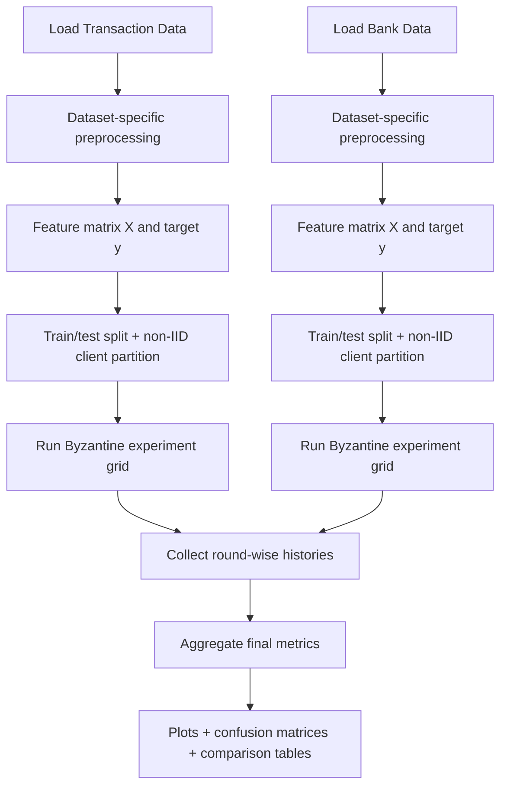
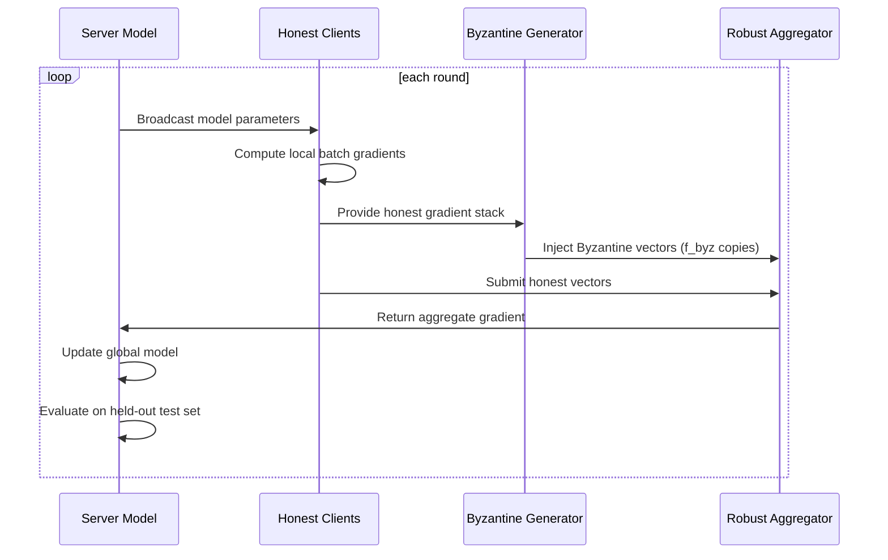

# Byzantine Adversarial Study

## Scope

This document explains the design and implementation of `Compare-Byzantine.ipynb`, which compares Byzantine-resilience behavior across two federated-learning (FL) tabular datasets:

- `transaction_data.csv`
- `bank_transaction_data.csv`

The notebook standardizes the training and adversarial setup so differences in outcomes are attributable primarily to data characteristics and not to inconsistent experiment logic.

---

## 1) Study Objective

The study answers four practical questions:

1. How much do Byzantine attacks degrade FL when using standard averaging?
2. How consistently do robust aggregators (`Median`, `TrMean`) recover performance?
3. Do robustness patterns transfer across different transaction datasets?
4. Which metrics best reveal risk under adversarial updates (accuracy vs precision/recall/F1/confusion)?

---

## 2) Experiment Plan

## 2.1 Shared protocol across datasets

To ensure comparability, the notebook enforces the same protocol for both datasets:

- 80/20 train-test split
- Non-IID partitioning into client shards (label-sorted split)
- Same local/global model family (logistic head)
- Same adversarial profiles and hyperparameters
- Same evaluation bundle and visual outputs

## 2.2 Attack and defense matrix

Each dataset runs the following strategy grid:

- `No attack + Average`
- `IPM + Average`
- `IPM + Median`
- `IPM + TrMean`
- `ALIE + Average`
- `ALIE + Median`
- `ALIE + TrMean`

Where:

- `IPM` = `InnerProductManipulation(tau=3.0)`
- `ALIE` = `ALittleIsEnough(tau=1.5)`
- Byzantine client count parameter: `f_byz = 2`

---

## 3) Implementation Walkthrough

## 3.1 End-to-end flow

## 3.2 Dataset preprocessing logic

### Transaction dataset pipeline

- Label: `target = (UserId == -1)`
- Numeric features: item counts, unit cost, total spend, hour/day-of-week
- Categorical compression: top countries + one-hot
- Numeric standardization

### Bank dataset pipeline

- Label: `target = Fraud Flag (True/False -> 1/0)`
- Numeric features: amount, latency, bandwidth, hour/day-of-week
- Categorical features: transaction type/status, device, network slice (one-hot)
- Numeric standardization

Illustrative feature contrast:

| Dataset | Label semantics | Key numerics | Key categoricals |
|---|---|---|---|
| Transaction | anonymized user indicator | count/cost/spend/time | country |
| Bank | fraud flag | amount/network/time | type/status/device/slice |

## 3.3 Federated simulation mechanics

### Key implementation choices

- Per-client batch size adjusted to avoid empty loaders (`drop_last=False`)
- Gradient flattening and reconstruction for vectorized robust aggregation
- Shared experiment function `run_federated_experiment(...)` across both datasets

## 3.4 Metric instrumentation

Round-level:

- `test_acc`
- `test_loss`
- `agg_update_norm`

Final-level:

- precision
- recall
- F1
- confusion matrix

This dual-level instrumentation captures both convergence dynamics and endpoint quality.

---

## 4) Visual Outputs in `Compare-Byzantine.ipynb`

1. **Accuracy trajectories**  
   Side-by-side dataset panels for temporal behavior under each strategy.

2. **Final metric bars (precision/recall/F1)**  
   Direct cross-dataset comparison by strategy.

3. **Confusion matrices**  
   Per attacked scenario (`IPM`, `ALIE`) and per dataset.

4. **Tabular summary**  
   Final metrics sorted for quick ranking and diagnostics.

---

## 5) Observations and Experimental Interpretation

> The exact values depend on runtime sampling and environment; the patterns below reflect expected interpretation of this setup.

## 5.1 Robustness pattern

- `Average` usually degrades most under attack.
- `Median` and `TrMean` generally recover part of the degradation.
- The degree of recovery varies by dataset structure and label separability.

## 5.2 Dataset sensitivity

- The bank dataset may exhibit different robustness profiles due to richer network/device categorical structure.
- The transaction dataset may show different failure modes due to anonymization-target framing.

## 5.3 Why confusion matrices matter

Accuracy can hide operationally important failure shifts.

Example:

- Two strategies both show similar accuracy.
- One has much higher false negatives in positive class.
- In fraud-like settings, this can be unacceptable despite similar headline score.

## 5.4 Attack-specific behavior

- `IPM` often induces stronger directional drift.
- `ALIE` may induce subtler but still harmful perturbations.
- Robust aggregation should be tested against both, not only one.

---

## 6) Summary of Experiments

## 6.1 Experiment matrix summary

| Group | Attack | Aggregators |
|---|---|---|
| Clean baseline | None | Average |
| Stress group A | IPM | Average, Median, TrMean |
| Stress group B | ALIE | Average, Median, TrMean |

## 6.2 Practical findings summary

- Robust aggregation is not optional in untrusted FL contexts.
- Cross-dataset benchmarking is necessary before policy-level conclusions.
- Decision-making should rely on class-sensitive metrics plus confusion structure.

---

## 7) Stakeholder Takeaways

## 7.1 For Data Scientists

- Include adversarial stress tests in baseline model cards.
- Use F1/recall and confusion matrices as first-class metrics.
- Tune `f_byz`, `tau`, and rounds to map robustness envelopes.

Illustrative workflow:

1. Run `Average` under attacks.
2. Run `Median`/`TrMean` under same attacks.
3. Compare delta in recall and F1.
4. Select strategy minimizing harmful error types.

## 7.2 For Compliance Officers

- Treat adversarial robustness as a model risk control requirement.
- Require documented attack scenarios and mitigation outcomes.
- Enforce recurring re-validation after data or model drift.

Illustrative control evidence:

- attack parameter sheet (`IPM/ALIE`, `f_byz`, rounds)
- metric deltas from baseline to attacked scenarios
- residual-risk statement and approval rationale

## 7.3 For Executives

- This is a resilience and trust control for collaborative AI systems.
- Robust methods may add complexity, but reduce downside risk from poisoned updates.
- Governance-ready benchmarking reduces surprise failures in production.

Illustrative business framing:

- “Without robust aggregation, a small malicious subset can distort model behavior.”
- “With robust aggregation, performance degrades less and remains more predictable.”

---

## 8) Recommendations

1. Make robust aggregation benchmarking mandatory before FL rollout.
2. Add repeated-seed experiments and confidence intervals.
3. Expand attack suite beyond IPM/ALIE.
4. Define threshold-based release criteria on recall/F1 and confusion-matrix bounds.
5. Automate result export to `results/` for auditability.

---

## 9) Reproducibility Notes

- Notebook: `Compare-Byzantine.ipynb`
- Source notebooks compared:
  - `bank_transaction_byzantine.ipynb`
  - `byzantine-fl/transaction_byzantine_demo.ipynb`
- Data:
  - `transaction_data.csv`
  - `bank_transaction_data.csv`
- Seed control:
  - numpy / random / torch fixed (`SEED = 42`)

