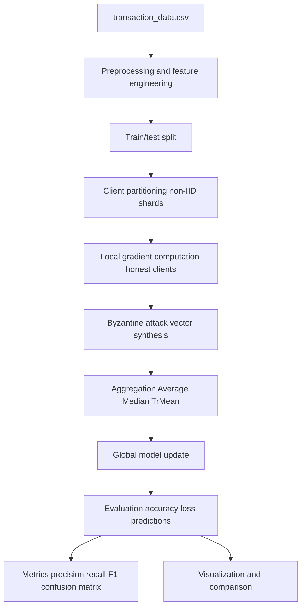
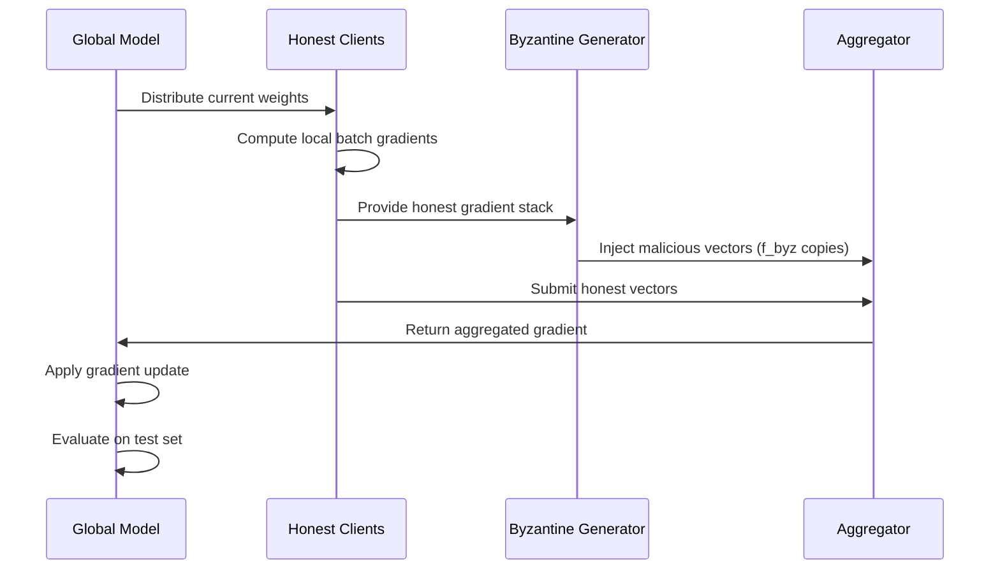

# Plan, Implementations, and Observations

## Scope and Goal

This document explains the implementation in `byzantine-fl/transaction_byzantine_demo.ipynb`, which adapts Byzantine-robust federated learning (FL) to a real transaction dataset (`transaction_data.csv`) and demonstrates:

- Data preparation and feature engineering for tabular FL
- Simulation of Byzantine attacks with ByzFL (`IPM`, `ALIE`)
- Comparison of robust and non-robust gradient aggregators
- Visualization of convergence and classification quality
- Business and governance interpretation for different stakeholders

---

## 1) Plan

### 1.1 Problem framing

The notebook defines a binary prediction task:

- Target: `is_anonymous = 1` if `UserId == -1`, else `0`
- Input: transaction behavior features (volume, spend, time, country)
- Setting: federated rounds with honest clients and simulated Byzantine participants

The intent is not to build a production fraud model, but to produce a reproducible demonstration of **robustness under adversarial client updates**.

### 1.2 Experiment design

The experimental matrix includes:

- Baseline: `No attack + Average`
- Attack 1 (`IPM`) with aggregators: `Average`, `Median`, `TrMean`
- Attack 2 (`ALIE`) with aggregators: `Average`, `Median`, `TrMean`

This design answers two core questions:

1. How much do Byzantine updates hurt standard FL aggregation?
2. How much do robust aggregators recover under attack?

### 1.3 Outputs for demonstration

Planned outputs in notebook:

- EDA charts (label distribution, country distribution, correlation map)
- Round-wise curves (test accuracy and test loss)
- Final metrics table (accuracy, precision, recall, F1, loss)
- Confusion matrices per attacked strategy

---

## 2) Implementation Details

## 2.1 End-to-end architecture

## 2.2 Data pipeline

Implemented preprocessing steps:

- Optional downsampling to 50,000 rows for runtime control
- Time parsing from `TransactionTime`
- Numeric conversions:
  - `NumberOfItemsPurchased`
  - `CostPerItem`
  - derived `total_spend = NumberOfItemsPurchased * CostPerItem`
- Temporal features:
  - `hour`
  - `day_of_week`
- Categorical compression:
  - top 10 countries retained
  - all others grouped into `Other`
  - one-hot encoded country indicators
- Standardization of numeric columns

Illustrative feature vector:

| Feature group | Example values |
|---|---|
| Numeric | `NumberOfItemsPurchased=0.8`, `CostPerItem=-0.3`, `total_spend=0.2` |
| Time | `hour=-1.1`, `day_of_week=0.4` |
| Country one-hot | `country_United Kingdom=1`, others `0` |

## 2.3 Federated simulation loop

### Client structure

- 8 honest client loaders
- Non-IID partitioning by label sorting then sharding
- Mini-batch local gradients from a logistic head (`Linear(in_dim -> 2)`)

### Round logic

### Attack implementations

- `InnerProductManipulation(tau=3.0)` (IPM):
  - malicious vector approximately opposes and scales mean honest gradient
- `ALittleIsEnough(tau=1.5)` (ALIE):
  - malicious vector uses coordinate-wise perturbation around honest mean

### Aggregators compared

- `Average` (non-robust)
- `Median` (coordinate-wise robust)
- `TrMean(f=f_byz)` (trimmed mean robust to extremes)

## 2.4 Evaluation and reporting

For each strategy:

- Round-wise:
  - `test_acc`
  - `test_loss`
  - `agg_update_norm`
- Final classification metrics:
  - precision
  - recall
  - F1
  - confusion matrix

Confusion matrix interpretation example:

| True \\ Pred | Known (0) | Anonymous (1) |
|---|---:|---:|
| Known (0) | TN | FP |
| Anonymous (1) | FN | TP |

- Higher `TP`, lower `FN` improve recall for anonymous class.
- Lower `FP` improves precision for anonymous predictions.

---

## 3) Observations from Experiment Design

Note: exact values depend on seed, sample, and runtime environment. The following are expected patterns for this implementation.

## 3.1 Convergence behavior

- `No attack + Average` typically gives the cleanest convergence signal.
- Under `IPM`/`ALIE`, `Average` usually degrades faster or stabilizes at weaker accuracy/F1.
- `Median` and `TrMean` generally recover part of the degradation, often with smoother trajectories.

## 3.2 Metric behavior

Typical robustness signature:

- Under attack:
  - `Average`: lower precision and/or recall, unstable F1
  - `Median` / `TrMean`: better F1 balance, fewer severe confusion-matrix failures

If class imbalance is strong, accuracy can appear acceptable while recall for `is_anonymous=1` drops; F1 and confusion matrices reveal this hidden risk.

## 3.3 Attack comparison: IPM vs ALIE

- `IPM` often causes larger directional drift in updates.
- `ALIE` can be subtler and may degrade decision boundaries without extreme gradients.
- Side-by-side attack panels are useful to show that no single attack profile captures all adversarial behavior.

---

## 4) Summary of Experiments

## 4.1 Experiment matrix

| Scenario | Attack | Aggregator | Purpose |
|---|---|---|---|
| Clean baseline | None | Average | Upper-bound reference behavior |
| Stress test 1 | IPM | Average / Median / TrMean | Compare robust vs non-robust under directional attack |
| Stress test 2 | ALIE | Average / Median / TrMean | Compare robust vs non-robust under variance-shaped attack |

## 4.2 Practical summary

- Robust aggregation is valuable when client trust is uncertain.
- Evaluating only accuracy is insufficient; include precision/recall/F1 and confusion matrices.
- Multiple attack types should be tested before making claims about robustness.

---

## 5) Takeaways by Audience

## 5.1 For Data Scientists

- **Modeling takeaway:** Robust aggregation should be part of baseline FL benchmarking, not an optional add-on.
- **Metric takeaway:** Report class-sensitive metrics (`precision`, `recall`, `F1`) for target class `is_anonymous`.
- **Experiment takeaway:** Run attack sweeps over `tau`, `f_byz`, and partition heterogeneity.

Example:

- If `Average` shows acceptable accuracy but high `FN`, anonymous-user detection risk is underreported.
- `TrMean` reducing `FN` at a minor precision cost may be operationally preferred.

## 5.2 For Compliance Officers

- **Risk-control takeaway:** Robust FL can reduce vulnerability to malicious participants in collaborative settings.
- **Governance takeaway:** Maintain evidence logs of attack simulations, metric deltas, and mitigation choices.
- **Policy takeaway:** Include adversarial-resilience checks in model validation gates.

Illustrative control checklist:

- [ ] Document tested attack families (IPM, ALIE, others)
- [ ] Record robustness thresholds per critical metric
- [ ] Track drift in confusion-matrix error types over time

## 5.3 For Executives

- **Business takeaway:** Byzantine robustness protects model reliability when training contributions come from partially trusted parties.
- **Decision takeaway:** Robust methods may slightly increase complexity but lower operational and reputational risk.
- **Investment takeaway:** Small upfront cost in robustness testing can prevent costly downstream failures.

Simple executive example:

- Without robustness, a partner-side poisoning event can silently reduce detection quality.
- With robust aggregation and monitoring, degradation is detected earlier and impact is limited.

---

## 6) Recommended Next Steps

1. Add repeated runs with confidence intervals (multiple seeds).
2. Add threshold analysis for precision-recall tradeoffs.
3. Expand attacks (`SignFlipping`, `Gaussian`, adaptive attacks).
4. Add fairness slices by country/time bucket.
5. Export a compact report artifact (CSV + plots) per run.

---

## 7) Reproducibility Notes

- Notebook file: `byzantine-fl/transaction_byzantine_demo.ipynb`
- Dataset used: `transaction_data.csv`
- Determinism: fixed seed (`SEED = 42`) for numpy/random/torch
- Runtime: configured for CPU and demo-scale data sample

