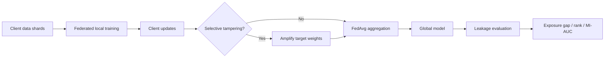
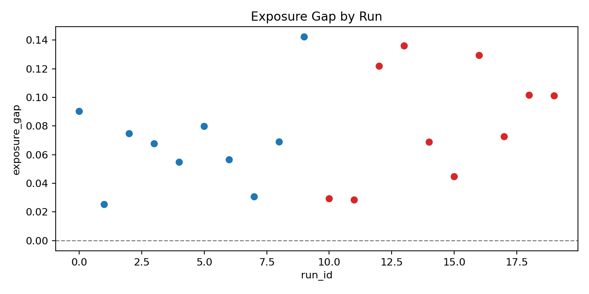
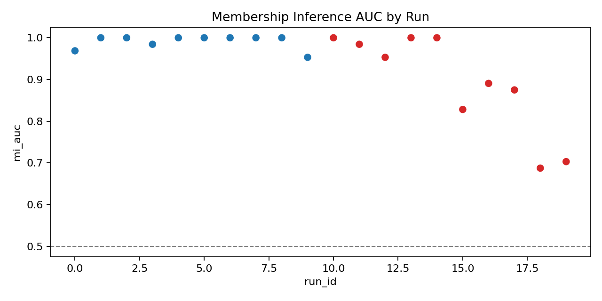
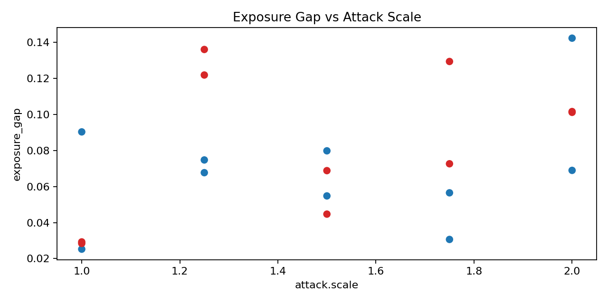
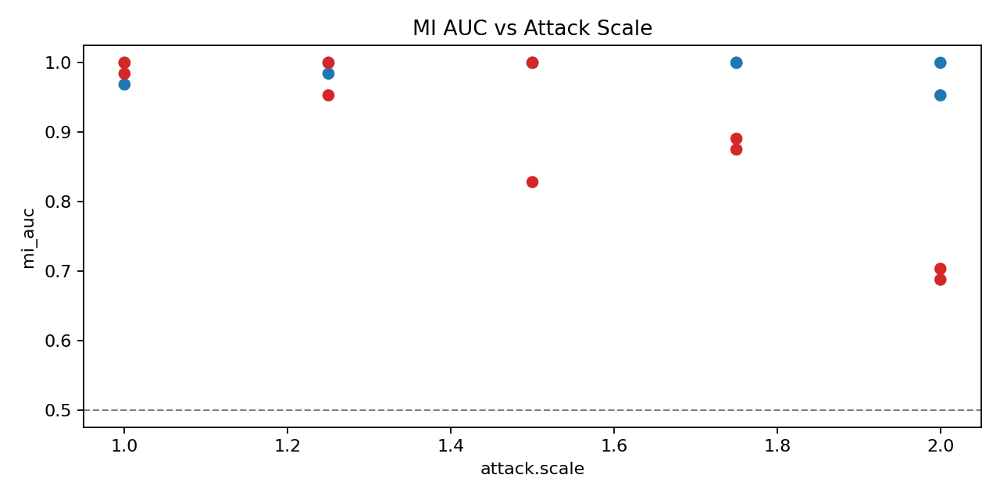
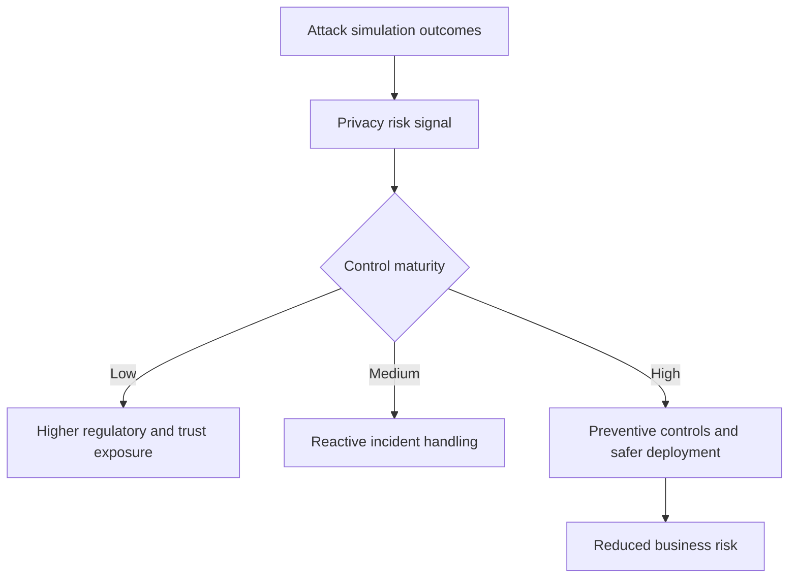

# Experiment Observations: Privacy Leakage via Selective Weight Tampering

This document summarizes results from:

- Single run: `results/single_run.csv`
- Sweep run: `results/sweep/sweep_results.csv` (20 runs)

## 1) Executive Snapshot

- Selective tampering increases **canary exposure on average** in this toy FL-LM setup.
- Mean exposure gap rose from **0.0691** (no attack) to **0.0834** (attack enabled).
- At stronger attack settings (`attack.scale` >= 1.75), exposure stays elevated (~0.101), and membership AUC degrades to ~**0.70** at `scale=2.0` (indicating unstable and potentially harmful model behavior).
- Business implication: manipulated client updates can change memorization behavior and may increase privacy risk, while also reducing model reliability.

## 2) For Data Scientists

### 2.1 Experimental setup used

- 8 clients, 30 FL rounds, tiny next-token model.
- Canary injected for one target client.
- Grid:
  - `attack.enabled`: `[false, true]`
  - `attack.scale`: `[1.0, 1.25, 1.5, 1.75, 2.0]`
  - `attack.noise_std`: `[0.0, 0.01]`
- Total runs: 20 (10 no-attack, 10 attack).

### 2.2 Core metrics

- **Exposure gap** = `control_loss - canary_loss`; higher positive values suggest stronger canary memorization signal.
- **Target rank** of canary destination token under canary source; lower rank means stronger memorization.
- **MI AUC** from sequence-loss scores (member vs non-member); higher AUC means stronger membership distinguishability.

### 2.3 Observed quantitative patterns

- **No attack** (10 runs):
  - Exposure gap mean: **0.0691** (min 0.0252, max 0.1423)
  - Target rank mean: **1.3**
  - MI AUC mean: **0.9906**
- **Attack enabled** (10 runs):
  - Exposure gap mean: **0.0834** (min 0.0284, max 0.1360)
  - Target rank mean: **2.3**
  - MI AUC mean: **0.8922** (min 0.6875, max 1.0)

Interpretation:

- Attack increases exposure gap overall, but with variance by seed and tampering intensity.
- MI AUC drops at high scale, suggesting tampering can make losses noisier and less separable, even while canary exposure remains high.

### 2.3.1 Sweep visualizations

**Exposure gap by run**

**Membership inference AUC by run**

### 2.4 By attack scale (attack-enabled runs only)

- `scale=1.0`: exposure ~**0.0288**, MI AUC ~**0.9922**
- `scale=1.25`: exposure ~**0.1289**, MI AUC ~**0.9766**
- `scale=1.5`: exposure ~**0.0567**, MI AUC ~**0.9141**
- `scale=1.75`: exposure ~**0.1010**, MI AUC ~**0.8828**
- `scale=2.0`: exposure ~**0.1014**, MI AUC ~**0.6953**

This suggests a non-linear regime: moderate-to-high tampering can increase exposure while simultaneously destabilizing membership signals.

**Exposure gap vs attack scale**

**MI AUC vs attack scale**

### 2.5 Concrete examples from your runs

- **Single run (`seed=42`, attack on):**
  - `exposure_gap=0.0865`, `target_rank=4`, `mi_auc=0.8438`
- **High-risk-style run (`run_id=13`, attack on, scale=1.25, noise=0.01):**
  - `exposure_gap=0.1360`, `mi_auc=1.0000`
- **Unstable high-scale run (`run_id=18`, attack on, scale=2.0, noise=0.0):**
  - `exposure_gap=0.1016`, `mi_auc=0.6875`

## 3) For Compliance Officers

### 3.1 Risk narrative

- This experiment shows that maliciously altered local updates can measurably shift memorization behavior in a federated model.
- Positive exposure gaps and low token ranks are warning signals that unique client patterns may be disproportionately retained.
- Even in a toy setup, this supports a credible threat model: **privacy leakage can be influenced by model update manipulation**.

### 3.2 Control implications

- Add technical controls:
  - Client update validation/anomaly detection
  - Robust aggregation (median/trimmed mean/clipping)
  - Differential privacy at client or server side
- Add governance controls:
  - Attack simulation in model risk assessments
  - Threshold-based alerting on leakage metrics
  - Required sign-off before production FL rounds when leakage KPIs regress

### 3.3 Example compliance thresholding

- Example policy:
  - Alert if rolling mean exposure gap increases >20% vs baseline
  - Block promotion if MI AUC exceeds predefined privacy-risk threshold or if canary rank improves suspiciously under adversarial tests

## 4) For Executives

### 4.1 What happened in plain language

- We simulated an attacker that tweaks selected model weights during federated training.
- Result: model memorization behavior shifts in ways consistent with elevated privacy concern.
- Stronger tampering did not always increase every metric, but it increased volatility and created several high-risk outcomes.

### 4.2 Business takeaway

- Federated training does not eliminate privacy risk by default.
- Security hardening and privacy testing must be part of release criteria, not post-hoc checks.
- A small investment in robust aggregation and leakage monitoring can prevent high-impact trust and regulatory incidents.

## 5) Limitations and Next Steps

- This is a toy LM; absolute values should not be treated as production-scale estimates.
- Canary and MI metrics can be sensitive to data generation and seed effects.
- Recommended next steps:
  - Run larger sweeps with multiple canary clients and repeated seeds per cell.
  - Add confidence intervals and statistical tests.
  - Compare defenses (clipping, robust aggregation, DP noise) against the same grid.
  - Move to a small real tokenizer/model pipeline after validating trends.
