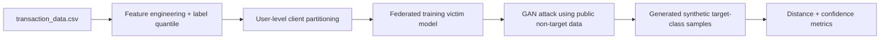
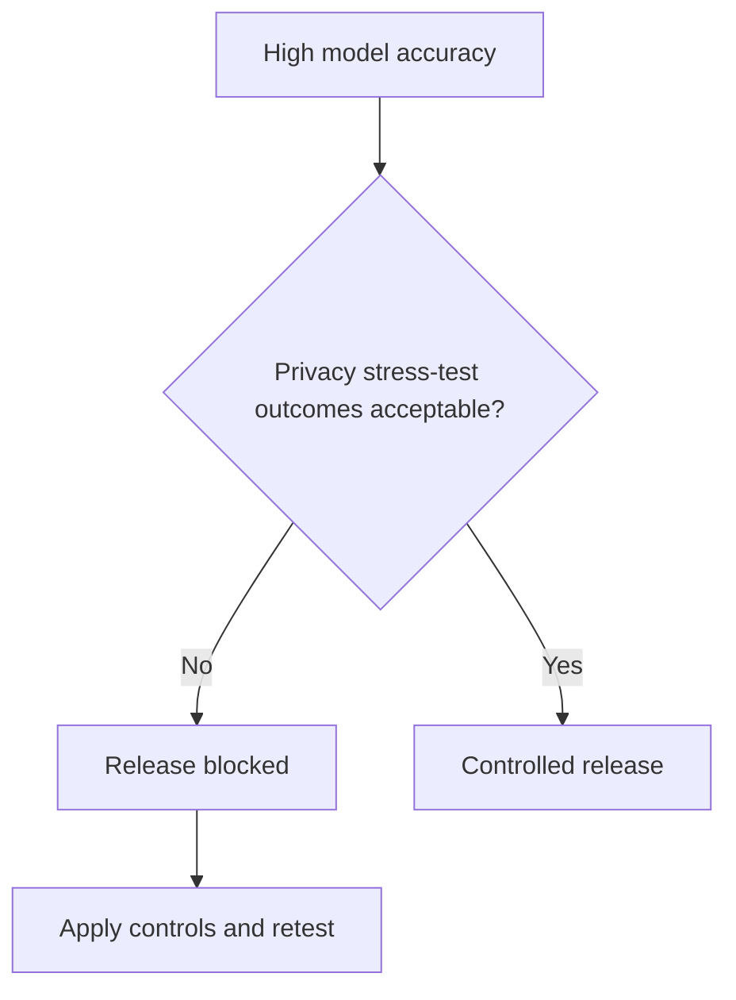
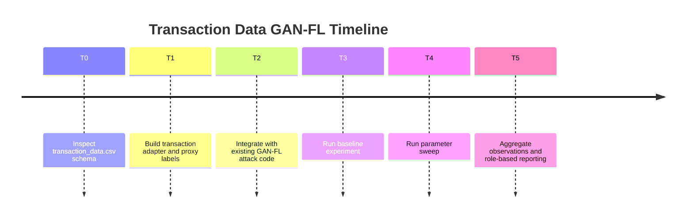

# Salary-Data GAN-FL: Plan, Implementation, and Observations

This report documents how the GAN-based Federated Learning attack was adapted to `transaction_data.csv`, executed, and interpreted.

## 1) Plan

- **Goal:** test whether a GAN-style adversary can generate samples that approximate a target client’s high-value transaction pattern (used here as a salary-like sensitive proxy).
- **Dataset source:** `transaction_data.csv`
- **Sensitive proxy label:** binary class from transaction value quantile
  - `target_private_class = 1` for transactions with `NumberOfItemsPurchased * CostPerItem` above the configured quantile.
- **Success criteria:**
  - global model utility remains high,
  - attack-trained generator moves closer to target private distribution than no-training baseline,
  - victim-model confidence on generated target-class samples increases substantially.

## 2) Implementation

### 2.1 What was added

- `gan_attack_fl/transaction_adapter.py`
  - parses `transaction_data.csv`,
  - builds 2D standardized features:
    - `log1p(NumberOfItemsPurchased)`
    - `log1p(NumberOfItemsPurchased * CostPerItem)`
  - creates binary target class by quantile threshold,
  - splits users into federated clients by hashed `UserId`,
  - selects a target client with enough positive class records.
- `scripts/run_gan_attack_fl_transaction.py`
  - single experiment run on transaction data.
- `scripts/run_gan_attack_fl_transaction_sweep.py`
  - parameter sweep runner.
- Configs:
  - `configs/gan_attack_fl_transaction_baseline.json`
  - `configs/gan_attack_fl_transaction_sweep_grid.json`

### 2.2 Flow of the adapted experiment



## 3) Execution

### 3.1 Baseline run command

```bash
python3 -m scripts.run_gan_attack_fl_transaction --config configs/gan_attack_fl_transaction_baseline.json
```

### 3.2 Sweep run command

```bash
python3 -m scripts.run_gan_attack_fl_transaction_sweep \
  --config configs/gan_attack_fl_transaction_baseline.json \
  --grid configs/gan_attack_fl_transaction_sweep_grid.json \
  --out-csv results/gan_attack_fl_transaction_sweep.csv
```

## 4) Observations

### 4.1 Baseline (transaction_data.csv)

- `global_test_accuracy: 0.9404`
- `target_client_id: 1` (baseline run)
- `mean_distance_to_target_private: 0.3711`
- `nearest_neighbor_distance: 0.0345`
- `target_confidence_on_generated: 0.6575`

Interpretation:

- The FL model keeps strong utility.
- The attack generates samples reasonably close to the target private class manifold in this setup.

### 4.2 Sweep summary (`results/gan_attack_fl_transaction_sweep.csv`)

Aggregated by `attack.attack_steps`:

| attack_steps | avg global accuracy | avg mean distance | avg nearest-neighbor distance | avg target confidence |
|---:|---:|---:|---:|---:|
| 0 | 0.9409 | 1.3328 | 0.6329 | 0.2030 |
| 120 | 0.9388 | 0.3100 | 0.0340 | 0.6225 |
| 220 | 0.9409 | 0.3552 | 0.0308 | 0.6547 |

Key pattern:

- With no GAN training (`steps=0`), generated samples are far from target-private samples and low-confidence.
- With training (`steps=120/220`), distances sharply decrease and confidence rises ~3x, while global model accuracy stays roughly unchanged.

### 4.3 Example run comparisons

- **No attack optimization (`run_id=0`)**
  - `nn distance: 0.6269`
  - `target confidence: 0.2001`
- **Optimized attack (`run_id=9`, `steps=220`)**
  - `nn distance: 0.0146`
  - `target confidence: 0.6489`

This indicates strong attack gain under current assumptions.

## 5) Audience-Specific Explanation

### 5.1 For Data Scientists

- The adapted pipeline treats high-value transaction behavior as the target private class.
- Attack quality is tracked with:
  - distributional closeness (`mean_distance`, covariance distance),
  - sample-level closeness (`nearest_neighbor_distance`),
  - model-conditioned alignment (`target_confidence_on_generated`).
- Empirically, GAN optimization substantially improves all three attack indicators without degrading victim utility.
- Example:
  - `steps=0` vs `steps=220` reduces average NN distance from `0.6329` to `0.0308`.

### 5.2 For Compliance Officers

- Privacy risk remains even without direct row-level exfiltration.
- Here, generated records become statistically and behaviorally close to a target client’s sensitive pattern class.
- Practical governance implications:
  - require adversarial privacy tests in model approval,
  - restrict model output exposure and monitor query patterns,
  - set policy thresholds for similarity/confidence risk indicators.
- Example threshold concept:
  - block promotion if attack-run nearest-neighbor distance drops below an internal risk floor while confidence exceeds policy threshold.

### 5.3 For Executives

- Plain language:
  - an attacker can train against the federated model and produce synthetic transactions that mimic sensitive customer behavior classes.
- Business impact:
  - potential trust, regulatory, and contractual exposure despite federated architecture.
- Decision guidance:
  - include privacy stress testing as a release gate, alongside accuracy targets.



## 6) Implementation Timeline



## 7) Limitations and Next Steps

- Sensitive attribute here is a proxy class (high transaction value quantile), not a confirmed salary field.
- 2D engineered features simplify the real feature space.
- Next steps:
  - add richer features (time, country embeddings, item-level aggregates),
  - run multi-seed confidence intervals,
  - evaluate defenses (differential privacy, output limiting, robust aggregation).
