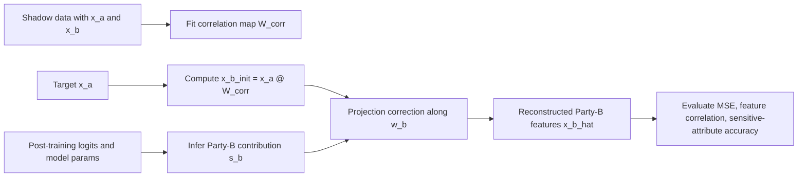

# Uncovering Hidden Correlations

Post-Training Data Reconstruction Attacks against Vertical Federated Learning (VFL)

## Objective

Demonstrate how an adversary can reconstruct Party B private features after training by combining:

- correlations between Party A and Party B feature spaces, and
- model-side information exposed post-training (per-sample logits).

## Threat Model

- Two-party VFL:
  - Party A holds `x_a`
  - Party B holds `x_b` (private target of reconstruction)
- A joint logistic model is trained over `[x_a, x_b]`.
- After training, attacker has:
  - Party A records for target users (`x_a_target`)
  - model parameters (`w_a`, `w_b`, `bias`)
  - per-target model logits
  - shadow/public data sampled from a similar population with both partitions

## Attack Idea

1. Learn hidden cross-party correlation map on shadow data:
   - `x_b ~= x_a @ W_corr`
2. Infer each target's Party B logit contribution:
   - `s_b = logit - (x_a @ w_a + bias)`
3. Reconstruct `x_b_hat` by:
   - starting from correlation prior `x_b_init = x_a @ W_corr`
   - projecting to satisfy model-consistency constraint `x_b_hat @ w_b ~= s_b`

## Mermaid: End-to-End Attack



## Implementation Components

- `vfl_hidden_correlations/data.py`
  - Generates vertically partitioned synthetic data with controllable latent correlation.
- `vfl_hidden_correlations/model.py`
  - Trains a VFL-style logistic model with separate weights for Party A and Party B.
- `vfl_hidden_correlations/attack.py`
  - Implements post-training reconstruction from hidden correlations + logit consistency.
- `vfl_hidden_correlations/metrics.py`
  - Computes reconstruction Mean Squared Error (MSE), mean feature correlation, and a sensitive-attribute proxy accuracy.
- `scripts/run_vfl_reconstruction.py`
  - Runs full pipeline from config.
- `configs/vfl_reconstruction_baseline.json`
  - Baseline experiment configuration.

## Run Example

From `FL-Privacy-Leakage/`:

```bash
python3 -m scripts.run_vfl_reconstruction --config configs/vfl_reconstruction_baseline.json
```

## Example Output (what to expect)

- `train_accuracy`: utility of trained VFL model
- `test_accuracy`: generalization utility
- `reconstruction_mse`: lower is stronger reconstruction
- `mean_feature_correlation`: higher is stronger reconstruction
- `sensitive_attribute_accuracy`: higher implies better recovery of sensitive proxy
- `logit_projection_residual_mse`: near-zero confirms projection constraint is met

## Interpreting Correlation Strength

- Higher `corr_strength` should usually improve reconstruction quality.
- Lower `corr_strength` should weaken hidden-correlation recovery.

Try:

- `corr_strength = 0.2`, `0.5`, `0.8` and compare `reconstruction_mse` + `mean_feature_correlation`.

Automated example:

```bash
python3 -m scripts.run_vfl_corr_sweep \
  --config configs/vfl_reconstruction_baseline.json \
  --corr-values 0.2,0.5,0.8 \
  --out-csv results/vfl_corr_sweep.csv
```

## Suggested Documentation and Reporting Template

For each run, log:

- Dataset settings (`n_train`, `d_a`, `d_b`, `corr_strength`)
- Model utility (`train_accuracy`, `test_accuracy`)
- Attack quality (`mse`, `mean_feature_correlation`)
- Sensitive proxy leakage (`sensitive_attribute_accuracy`)
- Assumptions (shadow data availability, logit access)

## Limitations

- Synthetic setup (not a real production VFL stack).
- Assumes access to per-sample logits and representative shadow distribution.
- Reconstruction is approximate and sensitive to distribution shift.
