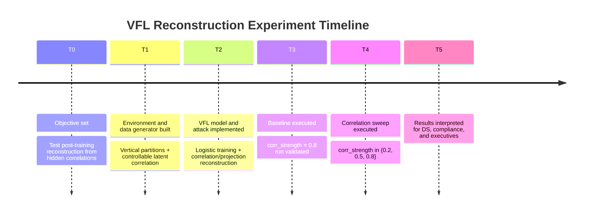
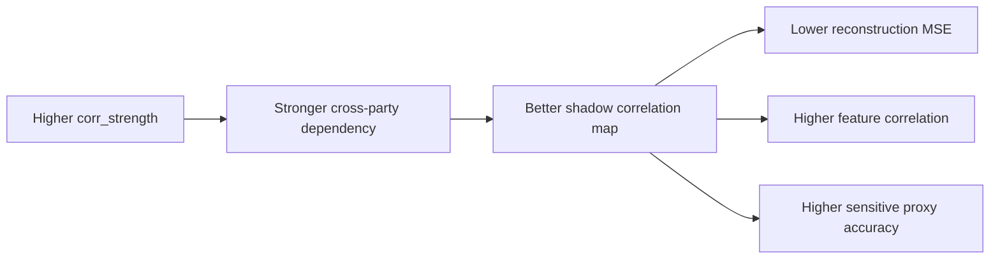
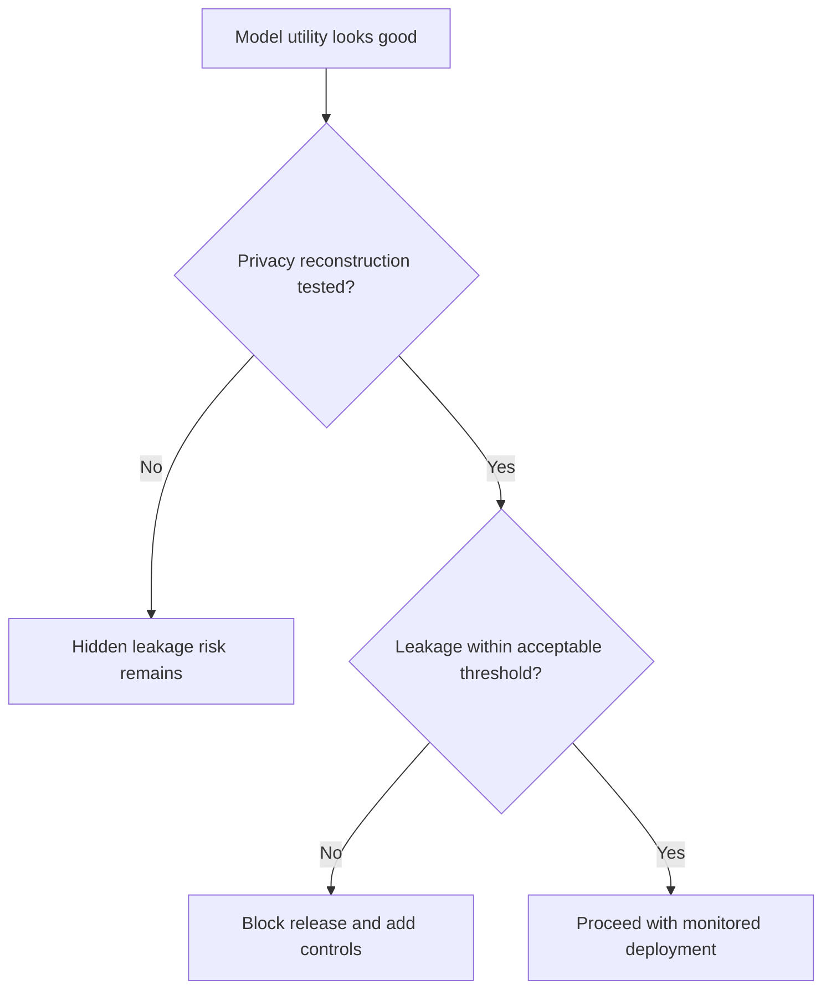

# Vertical Federated Learning: Plan, Implementation, and Observations

Uncovering Hidden Correlations - Post-Training Data Reconstruction Attacks against Vertical Federated Learning (VFL)

## 1) Plan

### 1.1 Problem Statement

Evaluate whether hidden cross-party feature correlations in VFL can enable post-training reconstruction of a private party's features.

### 1.2 Research Questions

- Can an attacker reconstruct Party B feature vectors using Party A features plus post-training model information?
- How does reconstruction quality change as hidden correlation strength increases?
- Can sensitive proxy attributes be recovered at practically meaningful rates?

### 1.3 Experimental Strategy

- Build a synthetic two-party VFL environment with vertically partitioned features.
- Train a joint logistic model with separate weights for Party A and Party B.
- Simulate an attacker with:
  - target Party A features,
  - post-training logits and model parameters,
  - shadow data sampled from a similar population.
- Measure reconstruction quality by:
  - reconstruction Mean Squared Error (MSE),
  - mean feature correlation,
  - sensitive-attribute proxy accuracy.

## 2) Implementation

### 2.1 Components Built

- `vfl_hidden_correlations/data.py`
  - Synthetic VFL partitions with controllable `corr_strength`.
- `vfl_hidden_correlations/model.py`
  - VFL-style logistic model training and utility metrics.
- `vfl_hidden_correlations/attack.py`
  - Post-training reconstruction using:
    - correlation prior from shadow data,
    - projection step to match observed Party B logit contribution.
- `vfl_hidden_correlations/metrics.py`
  - Reconstruction evaluation metrics.
- `scripts/run_vfl_reconstruction.py`
  - Single baseline run.
- `scripts/run_vfl_corr_sweep.py`
  - Correlation sweep experiment.
- `configs/vfl_reconstruction_baseline.json`
  - Baseline config.

### 2.2 Attack Construction

Given target record `x_a`, model parameters, and observed logit:

1. Fit correlation map from shadow data: `x_b ~= x_a @ W_corr`
2. Estimate Party B logit contribution:
   - `s_b = logit - (x_a @ w_a + bias)`
3. Build initial guess: `x_b_init = x_a @ W_corr`
4. Project onto model-consistency direction (`w_b`) to satisfy `x_b_hat @ w_b ~= s_b`

## 3) Execution Timeline



## 4) Baseline Results

From:

`python3 -m scripts.run_vfl_reconstruction --config configs/vfl_reconstruction_baseline.json`

- `train_accuracy = 0.8063`
- `test_accuracy = 0.8275`
- `corr_strength = 0.8`
- `reconstruction_mse = 0.070199`
- `mean_feature_correlation = 0.961356`
- `sensitive_attribute_accuracy = 0.890000`
- `logit_projection_residual_mse = 0.0000000000`

Interpretation: with strong hidden correlation and attacker-side assumptions, Party B features are reconstructed with high fidelity in this synthetic setting.

## 5) Correlation Sweep Results

Source: `results/vfl_corr_sweep.csv`

| corr_strength | train_accuracy | test_accuracy | reconstruction_mse | mean_feature_correlation | sensitive_attribute_accuracy |
|---|---:|---:|---:|---:|---:|
| 0.2 | 0.7437 | 0.7263 | 0.5255 | 0.4492 | 0.5700 |
| 0.5 | 0.8180 | 0.7613 | 0.4622 | 0.8674 | 0.8475 |
| 0.8 | 0.8677 | 0.8925 | 0.1119 | 0.9652 | 0.9138 |

Trend:

- As hidden correlation increases:
  - MSE decreases (better reconstruction),
  - feature correlation increases,
  - sensitive proxy recovery improves.



## 6) Role-Based Explanations

### 6.1 For Data Scientists

- This experiment operationalizes a post-training inverse problem in VFL.
- The attack combines:
  - statistical prior (`W_corr` learned from shadow data),
  - model-consistency constraint (`w_b` projection from observed logits).
- Baseline (`corr_strength=0.8`) shows strong recovery:
  - very low MSE and very high feature correlation.
- Example:
  - At `corr_strength=0.2`, sensitive proxy accuracy is `0.57`.
  - At `corr_strength=0.8`, it rises to `0.9138`.
- Practical meaning: cross-party dependence can become a structural leakage channel, not just an optimization artifact.

### 6.2 For Compliance Officers

- Risk signal: a party can infer another party's private features after training under realistic assumptions (shadow data + model outputs).
- Why this matters:
  - privacy harm can occur even when raw data is never directly shared.
- Control implications:
  - minimize exposure of per-sample logits or intermediate signals,
  - apply output hardening and access controls,
  - include reconstruction testing in privacy impact assessments.
- Example threshold policy:
  - flag models if sensitive proxy reconstruction exceeds predefined acceptable limits in adversarial validation.

### 6.3 For Executives

- Plain-language outcome:
  - federated setup can still leak private characteristics if datasets across parties are strongly correlated.
- Business impact:
  - potential compliance, trust, and contractual risk if inferred attributes are sensitive.
- Decision implication:
  - VFL deployment should require privacy stress-testing gates, not just utility metrics.



## 7) Examples You Can Reproduce

### 7.1 Baseline run

```bash
python3 -m scripts.run_vfl_reconstruction --config configs/vfl_reconstruction_baseline.json
```

### 7.2 Correlation sweep run

```bash
python3 -m scripts.run_vfl_corr_sweep \
  --config configs/vfl_reconstruction_baseline.json \
  --corr-values 0.2,0.5,0.8 \
  --out-csv results/vfl_corr_sweep.csv
```

## 8) Limitations and Next Steps

- Synthetic data and simplified model; not a production VFL stack.
- Assumes attacker can access per-sample logits and representative shadow data.
- Next steps:
  - multi-seed confidence intervals,
  - larger feature spaces and non-linear models,
  - compare defenses (output perturbation, access minimization, robust protocol design).
